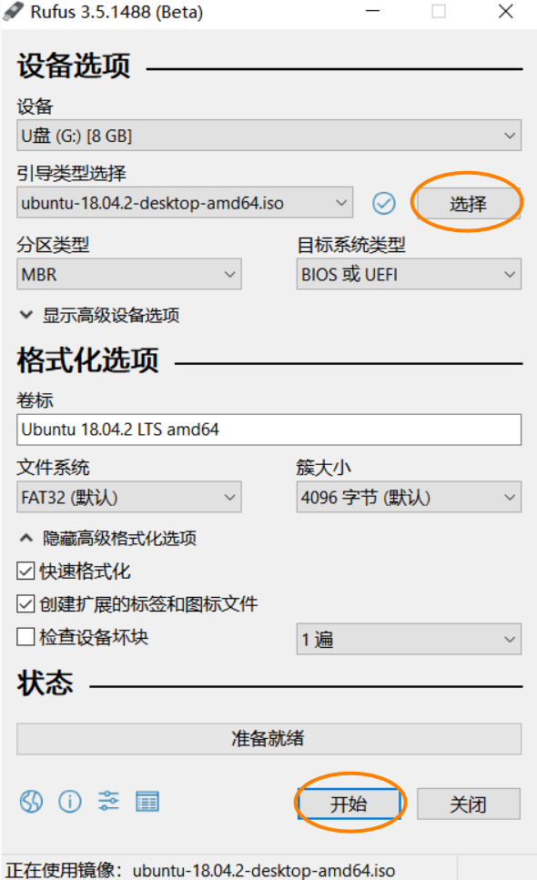

# Ubuntu/Centos 服务器环境配置

系统安装及环境配置实践总结

## windows 10 、Ubuntu 18.04 双系统安装

每次安装 Ubuntu 系统都曲曲折折！2019 年夏天的某个周六，又折腾了一整天系统安装和环境配置。。。

安装双系统的教程网上非常多，但总是没有一个是完全适合自己的。只能遇到问题再解决问题。

先看常规正常安装教程

1. 下载 [Ubuntu 18.04.2 LTS ISO](https://cn.ubuntu.com/download) 文件
2. 下载 Ubuntu 官网推荐的 USB 启动盘制作工具 [Rufus](https://rufus.ie/)
3. 制作 Ubuntu 18.04 USB 启动盘

   - U 盘插入电脑，打开 Rufus, 点击 `选择`， 添加 `Ubuntu 18.04.2 LTS`, 其他设置如图所示，点击 `开始`, 后面一直选择 `OK`
     

4. 关闭 Win 10 快速启动 [操作步骤](https://jingyan.baidu.com/article/ca00d56c7a40e6e99febcf4f.html#!/article/ca00d56c7a40e6e99febcf4f)

5. 磁盘分区

   - 快捷键 `window + x`，`Ctrl + k` 打开 `磁盘管理`
   - 选择剩余空间较大的可分配磁盘，点击`右键`，选择`压缩卷`，压缩 50~80 G。**只需要压缩即可，无须新建简单卷。**[详见压缩教程](https://jingyan.baidu.com/article/54b6b9c09515222d593b475c.html)

6. BIOS 设置，重启电脑，按 `F12`、`F2`、`F8`

   1. Boot 设置
      - Boot Mode: UEFI
      - USB Boot: Enabled
   2. Security 设置
      - Secure Boot: Disabled
   3. 设置完成，按 `F10`, 重启过程中，按 `F12`、`F2`、`F8`，选择从 `U 盘` 启动

7. 开始安装
   - 安装类型，选择 `其他选项`, 进行分区
